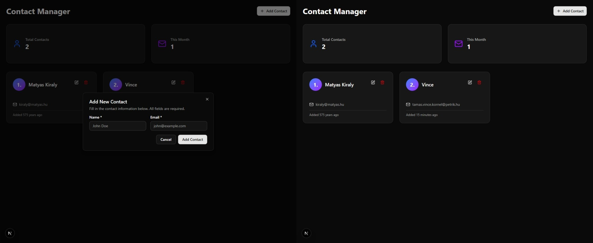

# Curveball Contact Manager



## Table of Contents
1. [Overview](#overview)
2. [Tech Stack](#tech-stack)
3. [API Endpoints](#api-endpoints)
4. [Database Schema](#database-schema)
5. [Features](#features)
6. [Installation](#installation--setup)
7. [Error Handling](#error-handling)

## Overview

The Contact Manager is a modern web application built with Next.js that allows users to manage their contacts effectively

### Key Features
- **CRUD Operations**: Create, Read, Update, Delete contacts
- **Real-time Validation**: Client-side form validation with Zod
- **Responsive Design**: Mobile-first approach with Tailwind CSS
- **Dark Mode**: Built-in dark theme support
- **Loading States**: Smooth user experience with loading indicators
- **Toast Notifications**: User feedback for actions
- **Modern UI**: Clean interface with shadcn/ui components

## Tech Stack

### Frontend
- **Next.js 15**: React framework with App Router
- **React 19**: UI library with hooks
- **TypeScript**: Type-safe JavaScript
- **Tailwind CSS**: Utility-first CSS framework
- **shadcn/ui**: Modern UI component library
- **Day.js**: Date manipulation library

### Backend
- **Next.js API Routes**: Server-side API endpoints
- **Prisma**: Database ORM and query builder
- **Database**: SQLite3 (kept in-memory by setting DATABASE_URL to `/tmp/database.sqlite3`)

## API Endpoints

### Base URL: `/api/contacts`

#### GET `/api/contacts`
Retrieves all contacts ordered by creation date (ascending).

**Response:**
```json
{
  "success": true,
  "data": [
    {
      "id": "string",
      "name": "string",
      "email": "string",
      "createdAt": "ISO 8601 string"
    }
  ]
}
```

**Error Response:**
```json
{
  "success": false,
  "message": "Internal server error"
}
```

#### POST `/api/contacts`
Creates a new contact.

**Request Body:**
```json
{
  "name": "string (required, 2-50 chars)",
  "email": "string (required, valid email, max 100 chars)"
}
```

**Success Response (201):**
```json
{
  "success": true,
  "data": {
    "id": "string",
    "name": "string",
    "email": "string",
    "createdAt": "ISO 8601 string"
  }
}
```

**Validation Error Response (400):**
```json
{
  "success": false,
  "error": "Name and email are required"
}
```

#### PUT `/api/contacts/[id]`
Updates an existing contact.

**Request Body:**
```json
{
  "name": "string (optional)",
  "email": "string (optional)"
}
```

**Success Response:**
```json
{
  "success": true,
  "updatedContact": {
    "id": "string",
    "name": "string",
    "email": "string",
    "createdAt": "ISO 8601 string"
  }
}
```

#### DELETE `/api/contacts/[id]`
Deletes a contact by ID.

**Success Response:**
```json
{
  "success": true
}
```

**Error Response (500):**
```json
{
  "success": false,
  "error": "Internal server error"
}
```

## Database Schema

```prisma
model Contact {
  id        String   @id @default(cuid())
  name      String
  email     String
  createdAt DateTime @default(now())
}
```

## Features

### 1. Contact List View
- Grid layout with responsive design
- Contact cards showing name, email, and creation date
- Statistics cards showing total contacts and monthly additions
- Empty state with call-to-action

### 2. Add Contact
- Modal dialog with form
- Real-time validation
- Loading states during submission
- Toast notifications for success/error

### 3. Edit Contact
- Pre-populated form with existing data
- Same validation as add form
- Immediate UI updates on success

### 4. Delete Contact
- Confirmation dialog before deletion
- Optimistic UI updates
- Error handling with user feedback

### 5. Form Validation
- Client-side validation with Zod
- Real-time error display
- Field-specific error messages
- Prevention of invalid submissions

## Installation & Setup

### Prerequisites
- [Bun](https://bun.sh/)

### Steps

2. **Install dependencies**
```bash
bun install
```

3. **Set up environment variables**
```bash
cp .env.example .env
```
Edit `.env` with your database connection string:
```
DATABASE_URL="your-database-connection-string"
```

4. **Set up the database**
```bash
bunx prisma generate
bunx prisma db push
```

5. **Run the development server**
```bash
bun dev
```

6. **Access the application**
Open [http://localhost:3000](http://localhost:3000) in your browser.

### Key Files

**`app/page.tsx`**
- Main application component
- Handles all contact management logic
- Manages form state and validation
- Implements CRUD operations

**`app/api/contacts/route.ts`**
- GET endpoint for fetching contacts
- POST endpoint for creating contacts
- Error handling and validation

**`app/api/contacts/[id]/route.ts`**
- PUT endpoint for updating contacts
- DELETE endpoint for removing contacts
- Parameter validation

## Error Handling

### Client-Side Error Handling
- Form validation with immediate feedback
- Network error handling with toast notifications
- Loading states to prevent multiple submissions
- Graceful degradation for failed requests

### Server-Side Error Handling
- Try-catch blocks around database operations
- Consistent error response format
- Proper HTTP status codes
- Error logging for debugging

### User Experience
- Clear error messages for validation failures
- Toast notifications for operation feedback
- Confirmation dialogs for destructive actions
- Loading indicators during async operations
